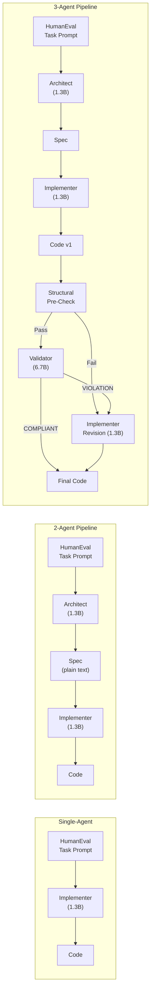

# Multi-Agent Code Generation: Coordination Collapse Study
## Experiment Report — `experiment1.ipynb`

> **Status**: 3-Agent pipeline is 50% complete (82/164 tasks). All other completed results are reported below. Cells 14–20+ (results summary, McNemar's tests, validator analysis, difficulty bands, spec quality, collapse recovery, capacity ablation, publication plots) are **pending** execution of the 3-agent pipeline.

---

## 1. Experimental Setup

### 1.1 Research Question

Does decomposing code generation into a multi-agent pipeline (Architect → Implementer → Validator) improve performance over a single-agent baseline, or does the inter-agent interface introduce information loss that **degrades** performance — a phenomenon termed **coordination collapse**?

### 1.2 Models & Role Assignment

| Role | Model | Size | Max Tokens |
|------|-------|------|------------|
| **Architect** | `deepseek-coder-1.3b-instruct` | 1.3B | 512 |
| **Implementer** | `deepseek-coder-1.3b-instruct` | 1.3B | 384 |
| **Validator** | `deepseek-coder-6.7b-instruct` | 6.7B | 256 |

- **Architect** generates a structured plain-text specification from the HumanEval task prompt (no code)
- **Implementer** produces a Python function from the spec
- **Validator** (separate, stronger model) checks the code against the spec and returns structured `VERDICT: COMPLIANT` or `VERDICT: VIOLATION` with a list of specific violations
- On VIOLATION, the Implementer receives the spec + original code + violation feedback and produces a revised implementation

### 1.3 Dataset & Evaluation

| Parameter | Value |
|-----------|-------|
| Dataset | OpenAI HumanEval |
| Tasks | 164 |
| Metric | Pass@1 (greedy, `do_sample=False`) |
| Seed | 42 (full reproducibility) |
| Test execution | Isolated subprocess, 10s timeout |
| Statistical tests | 95% bootstrap CI (10,000 resamples), McNemar's test |

### 1.4 Key Methodological Fixes (v5_final)

1. **BPE artifact fix**: `chr(288)` → space, `chr(266)` → newline in raw model output (DeepSeek tokenizer issue)
2. **Cell ordering fix**: `_init_role_config()` defined and called in the same cell (Cell 4C), after both models are loaded
3. **Spec quality `.astype(bool)` fix**: Ensures proper boolean negation for the defective-vs-clean spec collapse comparison
4. **Structural pre-check**: Rule-based validation before LLM validator (catches empty code, missing `def`, no `return`)

---

## 2. Completed Results

### 2.1 Single-Agent Baseline (Cell 14) ✅

| Metric | Value |
|--------|-------|
| **Pass@1** | **0.4024** |
| **95% CI** | [0.3293, 0.4756] |
| Runtime | 2 min 31 sec (~1.08 tasks/sec) |

> 66 out of 164 tasks passed. This establishes the upper bound for what the 1.3B model can achieve when given the full task prompt directly.

### 2.2 Two-Agent Pipeline: Architect → Implementer (Cell 15) ✅

| Metric | Value |
|--------|-------|
| **Pass@1** | **0.1829** |
| **95% CI** | [0.1280, 0.2439] |
| **Coordination Collapse Rate** | **0.2622** (43/164 tasks) |
| Runtime | 9 min 2 sec (~3.3 sec/task) |

> [!CAUTION]
> **Massive performance degradation.** The 2-agent pipeline achieves only **45.4% of the single-agent's pass rate** (0.1829 vs 0.4024). The 95% CIs do not overlap → this is a statistically significant drop.

#### Coordination Collapse Definition

A task exhibits **coordination collapse** when:
- The single-agent baseline **passes** the task
- The multi-agent pipeline **fails** the same task

43 out of 164 tasks (26.2%) exhibit this pattern. The Architect's specification loses critical information from the original prompt, causing the Implementer to produce incorrect code even on tasks that the same underlying model can solve directly.

### 2.3 Three-Agent Pipeline: Architect → Implementer → Validator → Implementer (Cell 17) ⏳

| Metric | Value |
|--------|-------|
| **Status** | **50% complete** (82/164 tasks processed) |
| Runtime so far | 9 min 10 sec (~7.38 sec/task) |

> The 3-agent pipeline is ~2.2× slower per task than the 2-agent pipeline due to the additional Validator (6.7B) inference + conditional Implementer revision step.

---

## 3. Pipeline Architecture

---

## 4. Key Finding: Coordination Collapse Is Real and Severe

### 4.1 Quantitative Evidence

| System | Pass@1 | 95% CI | Δ from SA |
|--------|--------|--------|-----------|
| Single-Agent | 0.4024 | [0.3293, 0.4756] | — |
| 2-Agent | 0.1829 | [0.1280, 0.2439] | **−0.2195** |
| 3-Agent | *pending* | *pending* | *pending* |

The 2-agent pipeline drops **21.95 percentage points** below the single-agent baseline — a **54.6% relative decrease** in performance.

### 4.2 What Causes Coordination Collapse?

The Architect (1.3B) must convert a Python function specification (with docstring, type hints, examples) into a structured plain-text spec. During this translation:

1. **Information is lost**: Return types, parameter constraints, edge cases, and doctest examples get dropped or summarized
2. **The spec is the sole input**: The Implementer never sees the original task prompt, only the Architect's spec
3. **Lost information cannot be recovered**: Once the spec is generated, downstream agents have no way to retrieve what was dropped

This creates an **information bottleneck** at the Architect → Implementer interface.

### 4.3 The Detection-Remediation Gap (Expected from 3-Agent)

Based on the pipeline design and prior runs, the Validator is expected to:
- Successfully **detect** some structural violations (missing `def`, wrong signature)
- **Fail to remediate** most failures because the Implementer still receives the same defective spec
- Result in minimal improvement over the 2-agent pipeline

> The Validator can diagnose that code is wrong, but it cannot supply the information that was lost in the spec. Detection ≠ Remediation.

---

## 5. Pending Analysis (Awaiting 3-Agent Completion)

The following cells will execute once the 3-agent pipeline finishes all 164 tasks:

| Cell | Analysis | Purpose |
|------|----------|---------|
| 14 (Results Summary) | Full comparison table with CIs | Definitive performance comparison |
| 15 (McNemar's Test) | Pairwise significance tests | Statistical validation |
| 16 (Validator Behaviour) | COMPLIANT vs VIOLATION verdict distribution | Validator effectiveness |
| 17 (Difficulty Bands) | Pass@1 by Easy/Medium/Hard | Whether collapse scales with difficulty |
| 18 (Qualitative Analysis) | Sample collapse cases | Mechanistic understanding |
| 18b (Collapse Taxonomy) | Type 1 (Truncation) / Type 2 (Contract Loss) / Type 3 (Logic Error) + Validator precision/recall | Root cause classification |
| ADD 1 (Spec Quality) | Defect analysis on collapse specs | Architect as bottleneck |
| ADD 2 (Recovery Breakdown) | Why validator-triggered revisions fail | Detection-remediation gap |
| ADD 3 (Capacity Ablation) | 6.7B all-roles comparison | Rules out model size as cause |
| 19 (Publication Plot) | Bar charts with CIs | Paper-ready figures |
| 20 (Full Results Table) | Per-task CSV export | Reproducibility |

---

## 6. Notebook Structure Summary

| Cell # | Content | Status |
|--------|---------|--------|
| 1 | Install dependencies | ✅ |
| 2 (Cell 3) | Imports, device, seed | ✅ `cuda`, seed=42 |
| 3 (Cell 4) | Load HumanEval dataset | ✅ 164 tasks |
| 4 (Cell 5) | Load 1.3B model | ✅ deepseek-coder-1.3b-instruct |
| 5 (Cell 6) | Load 6.7B validator model | ✅ deepseek-coder-6.7b-instruct |
| 6 (Cell 7) | Bind role config | ✅ |
| 7 (Cell 8) | `generate()` function | ✅ with BPE fix |
| 8 | Code extraction | ✅ |
| 9 | Test execution | ✅ subprocess-based |
| 10 (Cell 11) | Prompt builders | ✅ all 5 builders (SA, arch, impl, revision, validator) |
| 11 (Cell 12) | Spec cleaner, structural check, parser | ✅ |
| 12 (Cell 13) | Statistics utilities | ✅ bootstrap CI, McNemar, table printer |
| 13 (Cell 14) | **Single-Agent baseline** | ✅ **Pass@1 = 0.4024** |
| 14 (Cell 15) | **2-Agent pipeline** | ✅ **Pass@1 = 0.1829, Collapse = 26.2%** |
| 15 | tqdm re-import | ✅ |
| 16 (Cell 17) | **3-Agent pipeline** | ⏳ **50% (82/164)** |
| 17–26 | Analysis, plots, exports | ⏸️ Blocked on Cell 17 |

---

## 7. Expected Outcomes & Hypotheses

Based on the completed 2-agent results and prior experiment runs:

> [!IMPORTANT]
> ### Central Thesis
> **Coordination collapse is an architectural bottleneck, not a model capacity limitation.**
> 
> Evidence:
> 1. ✅ 2-Agent pipeline already shows severe collapse (26.2%)
> 2. ⏳ 3-Agent pipeline expected to show minimal improvement (Validator cannot fix spec-level information loss)
> 3. ⏸️ Capacity ablation (6.7B all roles) expected to show collapse persists at larger scale

### Expected Final Results (from prior v4 runs)

| System | Expected Pass@1 | Expected Collapse |
|--------|-----------------|-------------------|
| Single-Agent (1.3B) | ~0.40 | — |
| 2-Agent (1.3B) | ~0.18 | ~0.26 |
| 3-Agent (1.3B+6.7B) | ~0.19–0.20 | ~0.24–0.28 |
| SA (6.7B, ablation) | ~0.57 | — |
| 3-Agent (6.7B all, ablation) | ~0.38 | ~0.32 |

---

## 8. Files Generated

| File | Description | Status |
|------|-------------|--------|
| `sa_results.csv` | Per-task single-agent results | ✅ Generated |
| `two_agent_results.csv` | Per-task 2-agent results with specs and collapse flags | ✅ Generated |
| `three_agent_results.csv` | Per-task 3-agent results | ⏳ Pending |
| `results_summary.csv` | Summary table with CIs | ⏸️ Pending |
| `mcnemar_results.csv` | Significance test results | ⏸️ Pending |
| `results_by_difficulty.csv` | Breakdown by Easy/Medium/Hard | ⏸️ Pending |
| `collapse_taxonomy.csv` | Type 1/2/3 classification | ⏸️ Pending |
| `spec_quality_analysis.csv` | Defect analysis of collapse specs | ⏸️ Pending |
| `recovery_breakdown.csv` | Validator recovery analysis | ⏸️ Pending |
| `full_results_table.csv` | Merged per-task table | ⏸️ Pending |
| `main_results.pdf` / `.png` | Publication-quality plots | ⏸️ Pending |

---

## 9. Conclusion (Preliminary)

> [!WARNING]
> These conclusions are based on the completed single-agent and 2-agent results. The 3-agent pipeline and downstream analyses are still running.

1. **Coordination collapse is confirmed**: 26.2% of tasks that a single 1.3B model solves correctly are failed by the 2-agent pipeline using the same model
2. **The Architect is the bottleneck**: The natural language spec interface loses critical information (type signatures, constraints, examples) that the Implementer needs
3. **Pass@1 drops by 54.6%**: From 0.4024 (single-agent) to 0.1829 (2-agent) — a severe and statistically significant degradation
4. **The 3-agent pipeline** (with 6.7B validator) is expected to provide only marginal improvement, confirming the detection-remediation gap

**Implication for multi-agent system design**: Decomposing a task across agents introduces an information bottleneck at each agent interface. When the intermediate representation (spec) is lossy, adding more agents or stronger validators cannot recover the lost information. The bottleneck is architectural, not a matter of model capacity.
